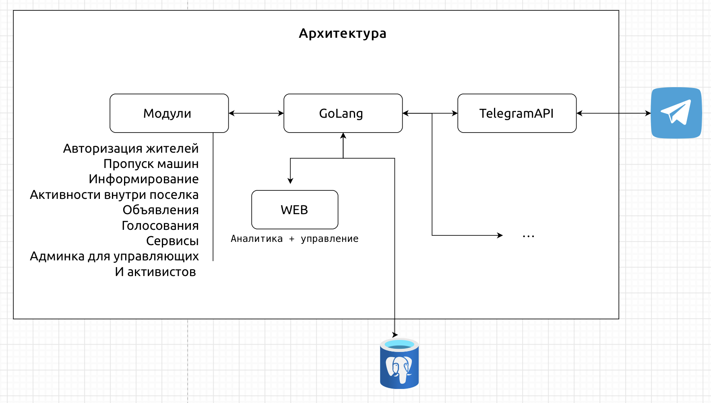
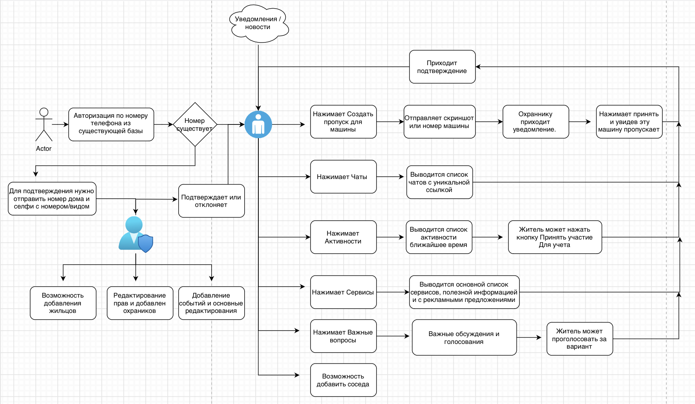

# Dwellers_Bot 
> Telegram + Django бот для жителей городка. (Жителей жилых комплексов)
Стадия: Концепт
## Описание

👋 Привет! Это проект телеграмм бота для жителей частного посёлка. Пока что концепт умного посёлка, который будет развиваться и разрабатываться модульно.

Основная идея позволить жителям упростить и цифровизовать жизнь в посёлке.

### Основной функционал

- Для доступа к закрытым чатам, необходимо чтобы бот авторизовывал жильцов.
- С помощью него можно будет создавать пропуска для машин/открывать шлагбаум на КПП удалённо и получать скриншот с камеры.
- Это должно решить множество болей: пропускать доставку, такси и гостей, без необходимости звонить и просить пропустить охраника, и еще повышает надёжность и безопасность внутри посёлка.
- Получать актуальную информацию, а также активности внутри посёлка.
- Список актуальных вопросов, обсуждения и возможность проводить голосования.
- Барахолка. Возможность выставлять объявления о продаже и проводить аукцион.
- Сервисы. Список услуг для жителей. Внутренняя реклама.

